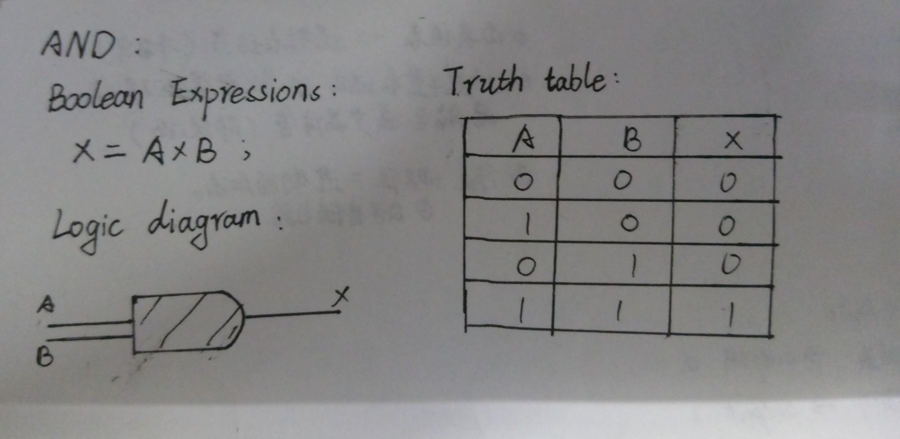
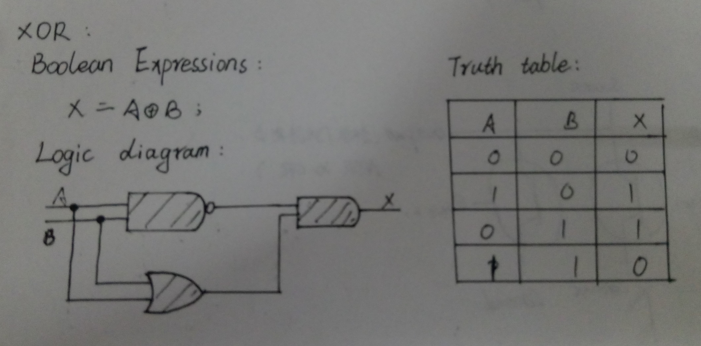
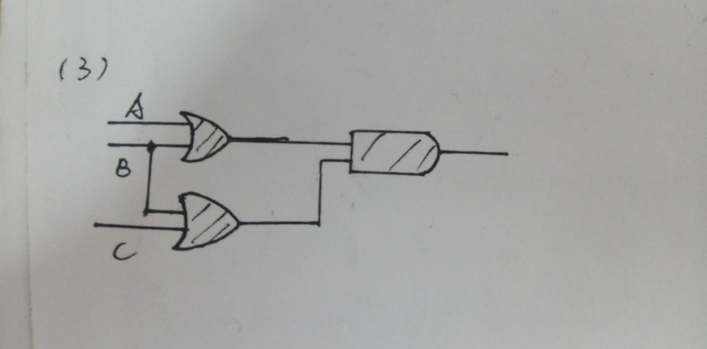
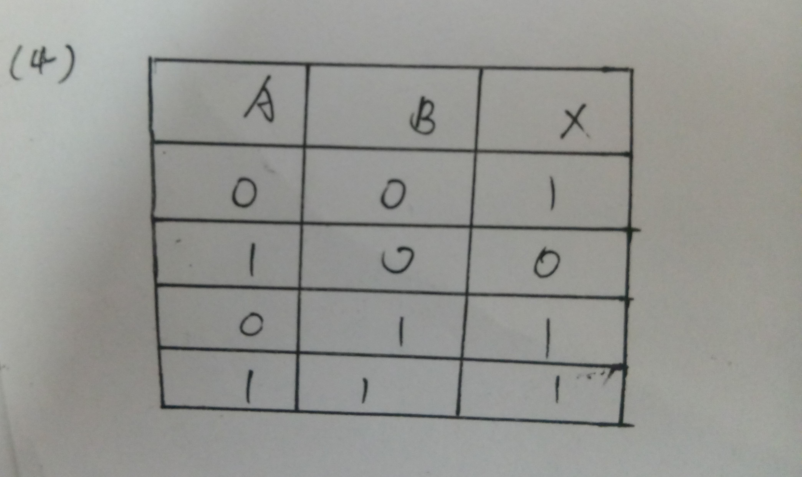
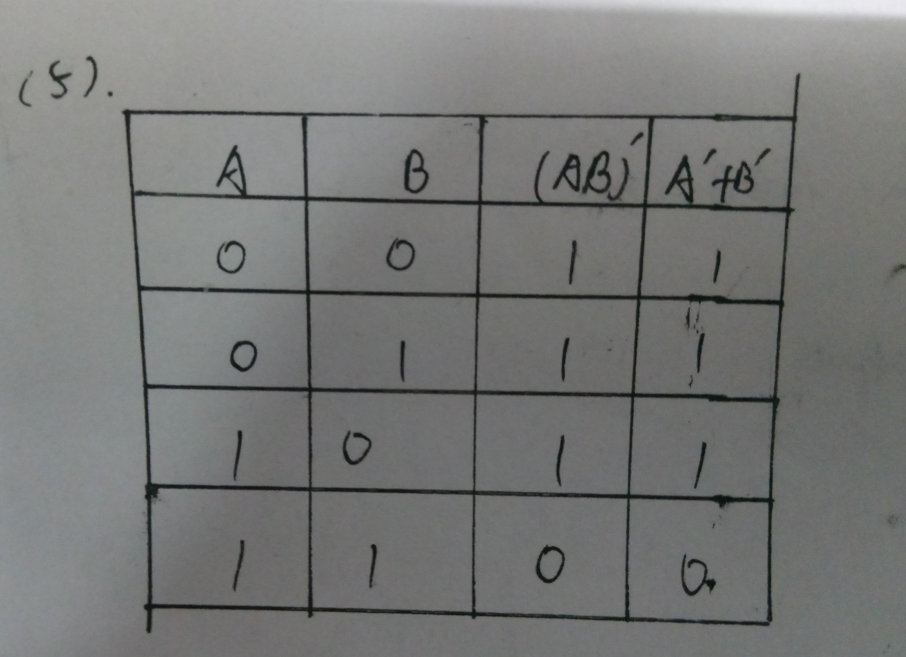
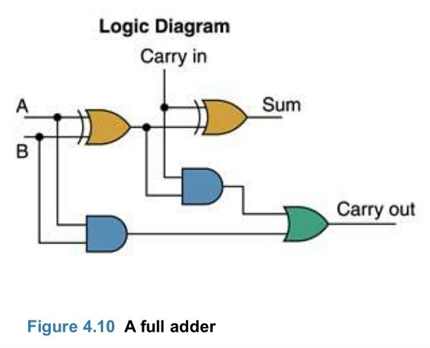
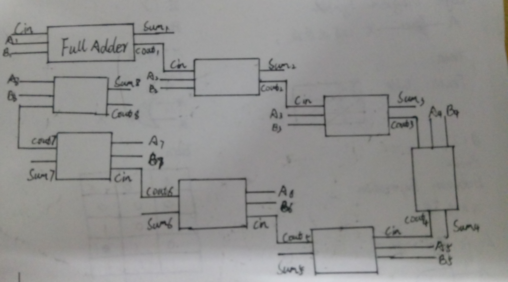

# 问题解答：
(1):AND的三种表达形式：

(2):XOR的三种表达形式：

(3):(A+B)(B+C)的逻辑电路图：

(4):Truth table of
is

(5)(AB)'=A'+B'的证明：

(6):八位二进制加法器：

Full adder:

(7):

(X8X7X6X5X4X3X2X1)2or(00001111)2=(X8X7X6X51111)2

(X8X7X6X5X4X3X2X1)2xor(00001111)2=(X8X7X6X5not(X4X3X2X1))2

(not(X8X7X6X5X4X3X2X1)2and(11110000)2)or
((X8X7X6X5X4X3X2X1)2and(00001111)2)=(not(X8X7X6X5)X4X3X2X1)2

# 名词解释：
### Logic gate:
In electronics, a logic gate is an idealized or physical device implementing a Boolean function; that is, it performs a logical operation on one or more binary inputs and produces a single binary output.

在电子学中，逻辑门是用于实现布尔函数的一个理想化装置或是一个实际的装置，它的功能是，对一个或多个二进制输入数实行逻辑操作，从而产生一个单一的二进制输出数。
### Boolean algebra:
In mathematics and mathematical logic, Boolean algebra is the branch of algebra in which the values of the variables are the truth values true and false, usually denoted 1 and 0 respectively.

在数学与数学逻辑中，布尔代数是代数的一个分支，它的变量的值是真值 true或false，通常分别用来表示1或0。

# 中文翻译：
### Flip-flop中文翻译：
触发器。

# The number of bits information that stored in a SR latch:
 2