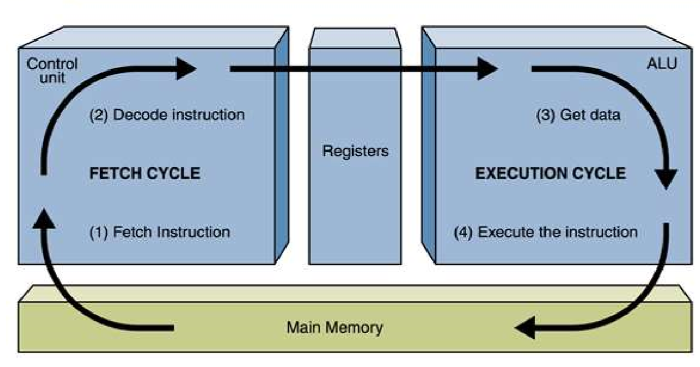
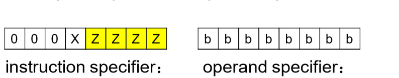

# 问题解答1：
## Program with machine language according to the following c. 

## int_8 a = 1;  

## int_8 c = a + 3;  
## 1）

    汇编语言            机器语言(十六进制)

    LDA 0x0001,i        C00001

    STA 0x0001,d        E10001

    ADDA 0x0003,i       700003

    STOP                00

    .END

## 2）Explain machine code execution with the fetch-decode-execute cycle ：
>
## 3）IR寄存器，PC寄存器和ACC寄存器的作用：

### IR寄存器：
1）指令寄存器，储存当前执行的指令；

2）保存将被储存的数据；

3）保存下一个数据储存的地址；

4）保存当前CPU所访问的主存单元的地址；
### PC寄存器：
程序寄存器，保存下一条将被读取的指令的地址；
### ACC寄存器：
用于储存算术与逻辑运算器（ALU）算数或逻辑计算的中间结果；
## 4）vars a & c ：
定义变量a与变量c；
# 问题解答2：
### 1）内存中储存多个八位的二进制数；
### 2）由于数据与指令均为二进制数，因此可以存放于相同位置；
### 3）指令由两部分组成：命令指示与操作数（或一个地址），均为八位的二进制码；
>

instruction specifier:命令指示;     operand specifier:操作数。

其中x为寻址模式，1表示操作数为数据；0表示操作数为地址内容。

zzzz为操作码，指定操作；

bbbbbbbb为操作数或地址内容；

# 名词解释：
汇编语言（Assembly Language）：

汇编语言（英语：assembly language）是一种用于电子计算机、微处理器、微控制器，或其他可编程器件的低级语言。在不同的设备中，汇编语言对应着不同的机器语言指令集。一种汇编语言专用于某种计算机系统结构，而不像许多高级语言，可以在不同系统平台之间移植。

编译（Compiler） :

编译器（compiler），是一种计算机程序，它会将用某种编程语言写成的源代码（原始语言），转换成另一种编程语言（目标语言）。 
它主要的目的是将便于人编写、阅读、维护的高级计算机语言所写作的源代码程序，翻译为计算机能解读、运行的低阶机器语言的程序，也就是可执行文件。编译器将原始程序（source program）作为输入，翻译产生使用目标语言（target language）的等价程序。源代码一般为高级语言（High-level language），如Pascal、C、C++、C# 、Java等，而目标语言则是汇编语言或目标机器的目标代码（Object code），有时也称作机器代码（Machine code）。

命令式语言（Imperative programming：

命令式程序设计语言是基于动作的语言，以冯诺依曼计算机体系结构为背景。机器语言及汇编语言是最早的命令式语言。在这种语言中，计算机被看做是动作的序列，程序就是用语言提供的操作命令书写的一个操作序列。用命令式程序设计语言编写程序，就是描述解题过程中每一步的过程，程序的运行过程就是问题的求解过程，因此也称为过程式语言。Fortran、ALGOL、COBOL、C、Ada、Pascal等都是命令式程序设计语言。

函数编程语言（Functional programming）：

函数式编程（英语：functional programming）或称函数程序设计，又称泛函编程，是一种编程典范，它将计算机运算视为数学上的函数计算，并且避免使用程序状态以及易变对象。

过程式编程（Procedural programming）:

过程式程序设计（英语：Procedural programming），又称过程式编程、过程化编程，一种编程典范，有时会被视为是指令式编程的同义语。派生自结构化编程（Structured programming），主要采取程序调用（procedure call）或函数调用（function call）的方式来进行流程控制。流程则由包涵一系列运算步骤的程序（Procedures），例程（routines），子程序（subroutines）, 方法（methods），或函数（functions）来控制。在程序运行的任何一个时间点，都可以调用某个特定的程序。任何一个特定的程序，也能被任意一个程序或是它自己本身调用。