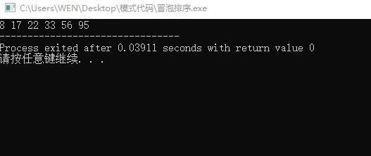
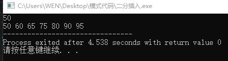
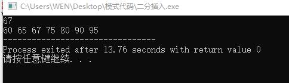
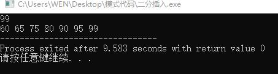

# 问题解答：
## 1. Bubble Sort the list: 33, 56, 17, 8, 95, 22。Make sure the final result is from small to large. 

Write out the list after the 2nd pass. (10 points) 

### Solution:
```c
#include<stdio.h>

void bubble_sort(int length,int arr[]){
	for(int i=length-1;i>0;--i){//顶的下降次数； 
		for(int j=length-1;j>length-1-i;--j){
			if(arr[j]<arr[j-1]){
				int temp=arr[j];
				arr[j]=arr[j-1];
				arr[j-1]=temp;				
			}
		}
	}
}

int main(){
	int s[]={33, 56, 17, 8, 95, 22};
	bubble_sort(6,s);
	for(int i=0;i<6;++i){
		printf("%d ",s[i]);
	}
	return 0;
} 
```
### 结果：


## 2. Give a sorted array as list={60,65,75,80,90,95}. Design an algorithm to insert the value of x into the sorted array. Then test the algorithm with value 50,67,99. 
```c
#include<stdio.h>
#define length 6

void turn_right(int begin,int arr[]){
	for(int i=length-1;i>=begin;--i){
		arr[i+1]=arr[i];
	}
}
void insert(int left,int right,int arr[],int num){
	if(num<=arr[left]){
		turn_right(left,arr);
		arr[left]=num;
	}
	else if(num>=arr[right]){
		turn_right(right+1,arr);
		arr[right+1]=num;
	}
	else if(num==arr[(left+right)/2]){
		turn_right((left+right)/2+1,arr);
		arr[(left+right)/2+1]=num;
	}
	else if(num>arr[(left+right)/2]){
		if((right-left)==1){
			turn_right(right,arr);
			arr[right]=num;
		}
		else insert((left+right)/2,right,arr,num);
	}
	else if(num<arr[(left+right)/2]){
		if((right-left)==1){
			turn_right(right,arr);
			arr[right]=num;
		}
		else insert(left,(left+right)/2,arr,num);
	}
}
int main(){
	int s[10]={60,65,75,80,90,95};
	int x;
	scanf("%d",&x);
	insert(0,5,s,x);
	for(int i=0;i<length+1;++i){
		printf("%d ",s[i]);
	}
} 
```
### 结果：
* 50




* 67




* 99





## 思考：为什么选择插入点在list头上、中间、尾巴上的三个数作为算法测试的数据，你能解释吗？

### 解释：运用折半查找的思想，每次比较将list分为存在插入点和不存在插入点两个部分，下一次比较操作只对存在插入点的部分进行，可使不断比较，将list不断分解直至找到插入点，这样做 使平均比较次数最少；


## 3. What is the state of the stack after the following sequence of Push and Pop operations? 
* Push “anne”; 
* Push “get”;
* Push “your” ;
* Pop;
* Push “my” Push “gun” 

### Answer：anne get my gun；