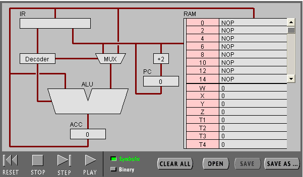
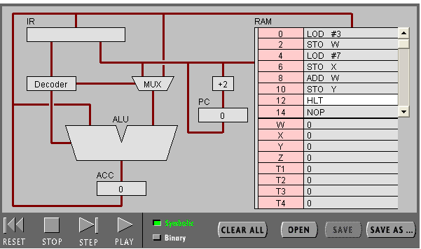
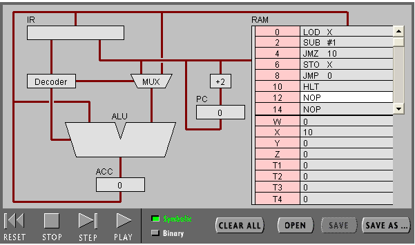
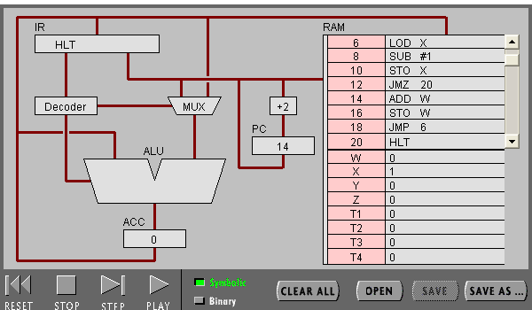

#  汇编实验报告
### 姓名：王裕文；学号：18342096； 

# 实验目的
* 理解冯·诺伊曼计算机的结构
* 理解机器指令的构成
* 理解机器指令执行周期
* 用汇编编写简单程序

# 实验步骤：

* 打开网页 The PIPPIN User’s Guide ，然后输入 Program 1：Add 2 number
* 点step after step。观察并回答下面问题：

# 任务 1：简单程序
## 1)点step after step。观察并回答下面问题：

### 1）PC，IR 寄存器的作用。
* PC寄存器：储存下一条指令的地址；
* IR寄存器：
   * 用来存放后续指令地址;
   * 储存正在执行的指令；
   * 储存将读入的数据；
   * 储存数据将储存的地址；
### ACC 寄存器的全称与作用。
* 全称：累加器；
* 作用：储存算术与逻辑运算器（ALU）算数或逻辑计算的中间结果；
### 用“LOD #3”指令的执行过程，解释Fetch-Execute周期。

(1)PC寄存器从内存（Memory）指定地址中读取指令LOD  #3 ；

(2)指令经地址总线传输至IR寄存器；

(3)IR寄存器将指令中的操作指令‘LOD’传输到解码器（Decoder）中进行解码（decode）并将解码后的操作指令传输到算术与逻辑运算器（ALU）与多路转接器（MUX）；

(4)IR寄存器将指令中操作数‘3’传输到多路转接器（MUX）后传输至算术与逻辑运算器（ALU），再经算术与逻辑运算后传输至累加器（ACC）；

(5)PC寄存器中地址加‘2’；(LOD  #3 指令操作结束)

### 用“ADD W” 指令的执行过程，解释Fetch-Execute周期。
(1)PC寄存器从内存（Memory）指定地址中读取指令ADD W ；

(2)指令经地址总线传输至IR寄存器；

(3)IR寄存器将指令中的操作指令‘ADD’传输到解码器（Decoder）中进行解码（decode）并将解码后的操作指令传输到算术与逻辑运算器（ALU）与多路转接器（MUX）；

(4)运算器从累加器（ACC）中提取数据‘7’；

(5)IR寄存器将指令中地址’W‘传输至内存，从’W‘读取数据’3‘至算术与逻辑运算器（ALU）；

(6)算术与逻辑运算器（ALU）进行对‘7’和‘3’进行加法操作，后将结果返回至累加器（ACC）；（ADD W 指令操作结束）

### “LOD #3” 与 “ADD W” 指令的执行在Fetch-Execute周期级别，有什么不同。
"LOD #3"只需访问主存一次，"ADD W"需要访问主存两次；
## 2）点击“Binary”,观察回答下面问题
### 写出指令 “LOD #7” 的二进制形式，按指令结构，解释每部分的含义。
    00010100 00000111

    
* 0001 中的’1‘为寻址模式表示操作数是数值；
* 0100 是操作码；
* 00000111 是指令中的数据‘7’；
### 解释 RAM 的地址。
只用于暂时存放程序和数据，一旦关闭电源或发生断电，其中的程序和数据就会丢失。
### 该机器CPU是几位的？（按累加器的位数）
* 16；
### 写出该程序对应的 C语言表达。
      int main(){
         int W=3;
         int X=7;
         int Y=X+W;
      }
      
# 任务 2：简单循环
## （1） 输入程序Program 2，运行并回答问题：

### 用一句话总结程序的功能
使‘x’的的值递减至1；
### 写出对应的 c 语言程序
    int main(){
      int X=10;
      while(X>1){
        --X;
       }
      }

## （2） 修改该程序，用机器语言实现 10+9+8+..1 ，输出结果存放于内存 Y

### 写出 c 语言的计算过程
      int main(){
         int X=10;
         int Y;
         while(X>1){
            --X;
            Y=Y+X;
         }
      }

### 写出机器语言的计算过程

      00010100 00001010
      00000101 10000001
      00000101 10000010
      00000100 10000001
      00010001 00000001
      00000101 10000001
      00001101 00010100
      00000000 10000010
      00000101 10000010
      00001100 00000110
      00000111 00000000

### 用自己的语言，简单总结高级语言与机器语言的区别与联系。
* 联系:高级语言经编译可变为机械语言,它们都可以实现顺序，选择和循环这三类基本语句； 

* 区别：高级语言更接近人类语言,是给人看的 ; 机器语言是纯粹的二进制 
数据，未经学习的人没办法看懂；

# 实验小结:

1.在对汇编语言的学习过程中,懂得了什么是汇编语言,机器语言,高级语言并知道 了他们之间的联系与区别 ；

2.知道了什么是指令格式和指令周期；

3.了解到 CPU 各组件的作用,与 CPU 的运算过程

