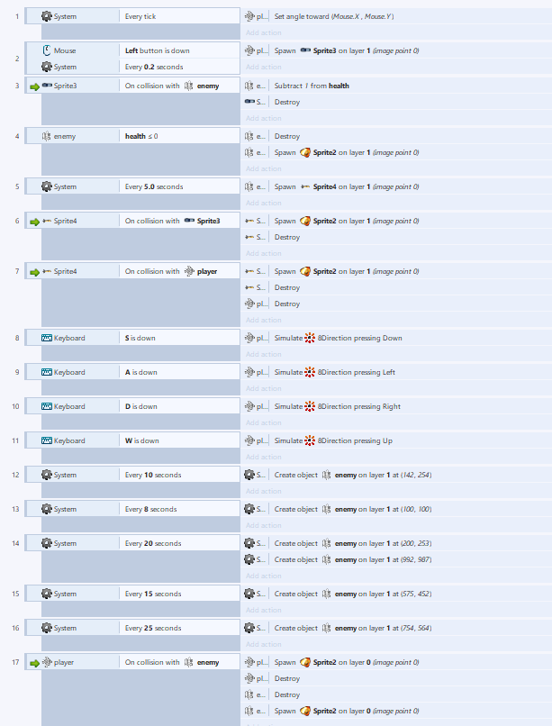

# HTML5游戏设计与制作(进阶篇)

## 前言：作为进阶篇，我们不仅需要学会制作游戏，还要学会如何制作一个完善的有具体规则，真正意义上的游戏。因此，进阶篇的重心将落在一个游戏的完善方面；
## 游戏策划：
### 名称：血战长空
### 楔子（背景）：1941年12月7日清晨，日本海军的航空母舰舰载飞机和微型潜艇突然袭击美国海军太平洋舰队在夏威夷基地珍珠港以及美国陆军和海军在瓦胡岛上的飞机场。时任海军航空兵的杰克上校紧急驾驶他的战斗机紧急起飞拦截日军轰炸机的进犯。
### 玩法：以 W 使战斗机向上飞行；以 S 使战斗机向下飞行；以 A 使战斗机向左飞行；以 D 使战斗机向右飞行；以 鼠标左键使战斗机发射子弹，尽量躲避与敌机相撞，避免被敌机炮弹击中。炮弹与敌机均可用子弹击落，敌机三颗，炮弹一颗；
### 人设与道具：
* 杰克上校所驾驶的战斗机(player)：能连续发射子弹，但接触炮弹与敌机就坠毁；任务是不让日军轰炸机到达屏幕右端；
* 日军轰炸机(enemy)：沿固定路线向珍珠港进发，会发射使杰克上校坠毁的炮弹；目的不顾一切是轰炸珍珠港；
* 炮弹：毁灭杰克上校；
* 子弹：毁灭侵略者；
### 实例展示： 
 

废话不多说，直接上图：

## 游戏设计&CRC卡片：
    +----卡片一：杰克上校的战斗机----+
    |           玩家               |
     ——————————————————————————————
    |   炮弹      |  碰撞&销毁自己  |
     ——————————————————————————————
    |   日军轰炸机 |  碰撞&销毁自己  |
    + —----------------------------+

    +----卡片二 ：日军轰炸机--------+
    |           敌人，生命值        |
     ——————————————————————————————
    |   子弹      |  碰撞&生命值-1  |
     ——————————————————————————————
    |杰克上校的战斗机| 碰撞&销毁自己 |
    + —----------------------------+
    
    +------卡片三：子弹-------------+
    |       摧毁敌人的武器          |
     ——————————————————————————————
    |    日军轰炸机|   碰撞&销毁自己 |
    +------------------------------+

    +-------卡片四：炮弹------------+
    |     摧毁杰克的罪恶武器         |
    ————————————————————————————————
    |杰克上校的战斗机|  碰撞&销毁自己 |
    +-------------------------------+