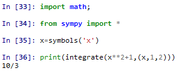
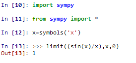
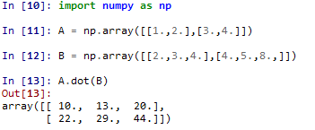
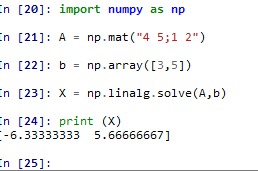

# 高数解答：
* 计算(x2+1)在[1,2]上的定积分；

* 计算sin(x)/x在x-->0时的极限；

# 线性代数解答：
 * 计算矩阵A与矩阵B的积；

       A: [1 2]     B:[2 3 4]
          [3 4]       [4 5 8]

* 计算矩阵A的的线性方程组AX=b的解；

         A:[4 5]     b ：[4]
           [1 2]         [5]

