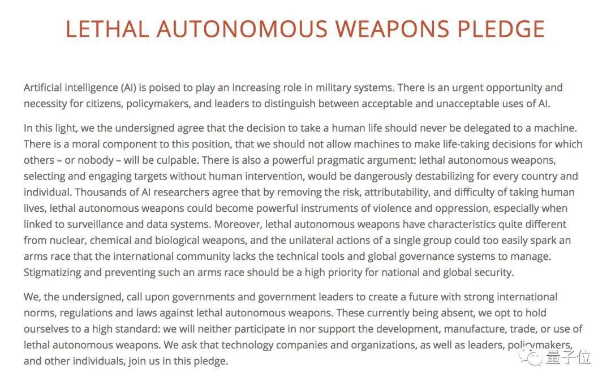
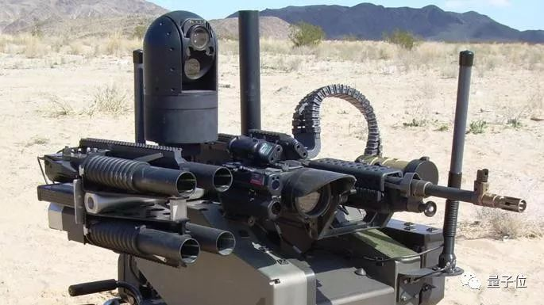

# 当人工智能武器被允许杀人，人类是否正在打开“潘多拉魔盒”

### 人工智能武器（以下简称为AI武器）概念：

### 人工智能武器是具有指挥高效化，打击精确化，操作自动化，行为智能化等特点的智能武器将在未来军事领域将占有重要地位。它可以“有意识”地寻找、辨别需要打击的目标，具有辨别自然语言的能力，是一种“会思考”的武器系统。

伴随着人类科技的快速发展，越来越多的奇思妙想变成现实。当今世界，人工智能俨然已成为衡量一国科研实力的重要标准，不仅在民用方面智能机器人被广泛运用，而且在军事领域早在上个世纪各国便大力研发智能武器，目前更是有愈演愈烈的趋势！

目前，多国已开发出多款拥有自主决策权的武器，如以色列开发的"哈比"无人机，能够在一个地区巡逻寻找雷达信号，一旦检测到,会自动俯冲轰炸信号源。以色列航太工业称哈比为“一劳永逸”型自主武器；

美国海军使用的宙斯盾舰导弹和飞机防御系统，据CNAS的一份报告称,它能够在没有人类干预的情况下接触到飞机或导弹

自动性更高的全自动武器如在日内瓦举办的联合国特定常规武器公约会议上震惊全场的AI杀人蜂，轻易躲过演讲人抓捕，通过人脸识别（面部识别）技术和定位锁定会场的雕像并实施打击，一击而中，极端致命！据统计已应用于实战并完成3000次精确打击。

还有军事家梦寐以求的，但尚未实现的所谓“永不睡觉的士兵”

虽然自主武器在军事上的应用，大大降低了战争中人员的伤亡，并且能更快捷便利达到军事行动的目标，但反对之声从未停歇：

从产能“地狱”归来的马斯克，刚刚领衔2000多名AI专家签署了一份特殊协议。

这份协议核心目的有且只有一个：承诺永不发展致命的AI武器系统。

在瑞典斯德哥尔摩举行的IJCAL 2018上，由MIT著名物理学家Max Tegmark发起，其任职主席的生命未来研究所（Future of Life Institute，FLI）起草，该协议一经发出就应者如云。
包含企业领域的马斯克、DeepMind联合创始人哈萨比斯、穆斯塔法，Shane Legg；Skype创始人Jaan Tallinn；全球顶尖AI学者Yoshua Bengio、Stuart Russell、Jürgen Schmidhuber等2400位全球AI科学家，都郑重签下了大名。

## 《致命性自主武器宣言》 

这份协议全称《致命性自主武器宣言》（lethal autonomous weapons pledge），核心内容就是宣誓不参与致命性自主武器系统（LAWS）的开发、研制工作，而且LAWS的研发及使用应当被严格禁止。

## 宣言称：

>* 人类个体生死的决定权，决不能交给机器。这一方面是出于道德层面的考虑，“掌控他人生死”这件让人产生负罪感的事，绝不能由没有感情的机器做出。

>* 而且致命的AI武器，不受人类干涉、自主选择攻击目标，可归责性与难度都前所未有，它们将成为暴力活动中的强大工具，尤其是与监控、数据系统相结合时。

宣言还强调：致命性自主武器的特征不同于核武器、化学武器及生物武器，研发团队可以单方开启军备竞赛，而国际社会缺乏实行管制的技术手段。谴责并避免这场军备竞赛，是维护全球安全的优先考虑事项。

>* 以罗素尔为代表的科学家指出，人工智能技术一旦用于制造不需要人类监管就能自动运行的武器，将打开智能化机器人全自动“杀人”的潘多拉魔盒，将会对人类安全和自由造成毁灭性打击。像“终结者”一样导致人类的灭亡。

早在2015年马斯克就与斯蒂芬-霍金、等知名人士以及千名学术界和工业界的人工智能专家共同签署了一封信，这封信主要是为了呼吁禁止滥用自主武器。警示AI致命武器潜在风险，以及正在发生的军备竞赛，呼吁颁布相关禁令。甚至有一些专家明确指出，一旦这些自主武器伤及人类，到底该谁负责，武器，程序设计者？（摘自凤凰军事）（摘自搜狐）
## 类似的反对事例比比皆是：

今年4月，先是韩国国防公司Hanwha Systems和韩国科学技术院联合建立国防和AI融合研究中心，遭遇全球50多名AI知名学者联名抵制。

其后谷歌AI参与美国国防部的MAVEN军事计划曝光，一时让这家“人类希望”公司内外交困，几乎被骂成“筛子”，3000多名员工联名抗议，不少员工选择离职。

最后在遭受猛烈抨击之后，谷歌推出了新准则，作为公司研发AI技术的道德指导。

然而谷歌并非个例。其他巨头与政府相关的AI合作也相继被曝光，在运用人脸识别进行身份监控等问题上，舆论、股东和员工抗议始终没有停止。(摘自搜狐)

## 虽说抗议声此起彼伏，但人工智能在军事上，尤其在全自动武器上的应用对于各国军方的诱惑实在太强了。

在军方，自主武器从2013年开始就开始在美国、英国、以色列和韩国等军方实验室中诞生。

区别于其他武器，致命性自主武器，能够在无人控制情况下，自主完成寻找目标、定位、击杀敌人这一整套工作，而AI系统和技术应用，是这些武器最强大的“驱动力”。
据美国媒体披露，美军在近10年使用武装无人机在战场上已致死至少1万人，是美军中杀人最多的武器。

据军事专家表示，并不期待美国和其他国家能够停止研发自主武器库：

>* “你不能指望着实现全面禁止自主武器” “使用这些武器的诱惑实在太强了”。

《镜报》称，美国、澳大利亚、俄罗斯、韩国、以色列等国家多次表达了他们继续探索发展杀人机器人的优势和益处的意愿。

“杀人机器人”全称为“致命性自主武器系统”，BBC曾以“永不睡觉的士兵”形容杀人机器人。
它是一种无人武器，一种用以代替士兵的全自动智能机器人。

>* 使用杀人机器人是有一定好处的。

因为使用杀人机器人代替士兵作战，可以降低士兵的伤亡率。此外，自主武器系统也省去了军人的薪水、住房、养老等开销，在速度、准确性上也远高于人类。

>* “禁止杀人机器人不是一个好主意”。

澳大利亚新闻网有文章称，武器并非罪恶之源，人才是，而自动武器可以快速高效地对类似澳大利亚的国家实施防护，因此杀人机器人是有积极作用的。

而在人力资源成本日益增加，战争的残酷程度越来越高的时代背景下，发展智能化武器已成各国的一致选择。高度智能的武器在战场上只需一道程序，便能够不吃不喝、24小时不间断的执行任务，试想有哪国能克制住对这类武器的诱惑！（摘自凤凰军事）

另据路透社，许多人表示，杀人机器人禁令可能会阻碍人工智能的发展。另一些人则担心，若是一些国家允许一些国家禁止，会产生严重的安全隐患。

## 总结：

在国际的质疑与反对的重重浪潮中，我们看到了科研工作者在人类未来抉择前的责任与担当。在现实的需求与伦理道德甚至人类未来的冲突中，人工智能仍在蓬勃发展。如何正确利用人工智能，是否应用于武器，将是一个长久的话题。需要身为人类的我们，一起探讨，决定属于人类的美好未来。

