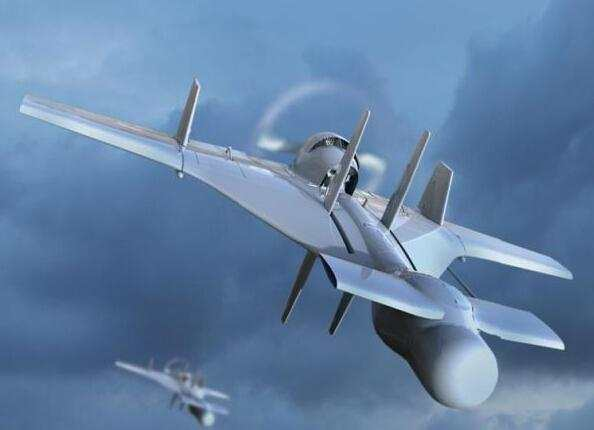
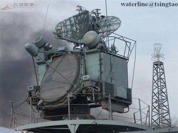
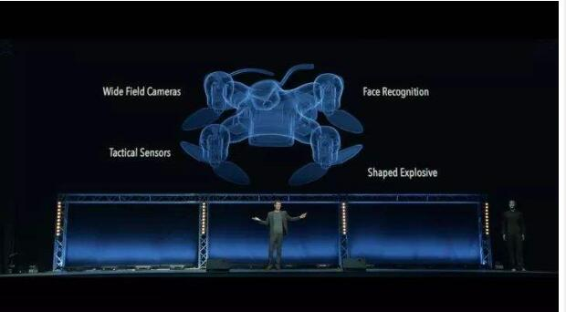
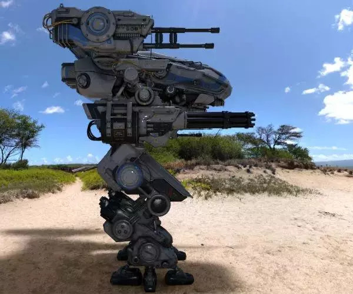

博客要求

社会与伦理是敏感话题，为了避免不必要的争议，原则要求是 “讲事实、不妄议”。即，可以总结，但不能评议！！！

请写一篇博客，收集 IT 领域伦理与道德的事实或观点。请选择以下任务之一：

以网站 或 app 为目标，整理、收集其中您认为有伦理风险的做法，例如：“淘宝网的一些伦理风险

行为收集”。要求每个事实有截图，有简要说明

以特定 行业 或 技术 为目标，通过网络检索，整理、收集相关伦理风险的观点，例如：“自动驾驶

引发的伦理问题”、“AI XX技术与伦理”、。要求每个观点有引用，说明来源

评分标准：

5分：有图或有引用；行文、逻辑较好，没有个人观点或评议

4分：有图或有引用；没有个人观点或评议

3分：有个人观点或评议

# 当AI武器被允许杀人，人类是否正在打开“潘多拉魔盒”
伴随着人类科技的快速发展，越来越多的奇思妙想变成现实。当今世界，人工智能俨然已成为衡量一国科研实力的重要标准，不仅在民用方面智能机器人被广泛运用，而且在军事领域早在上个世纪各国便大力研发智能武器，目前更是有愈演愈烈的趋势！

目前，多国已开发出多款拥有自主决策权的武器，如以色列开发的"哈比"无人机，能够在一个地区巡逻寻找雷达信号，一旦检测到,会自动俯冲轰炸信号源。以色列航太工业称哈比为“一劳永逸”型自主武器；

美国海军使用的宙斯盾舰导弹和飞机防御系统，据CNAS的一份报告称,它能够在没有人类干预的情况下接触到飞机或导弹

自动性更高的全自动武器如在日内瓦举办的联合国特定常规武器公约会议上震惊所有人的AI杀人蜂，轻易躲过演讲人抓捕，通过人脸识别（面部识别）技术和定位锁定会场的雕像并实施打击，一击而中，极端致命！据统计已应用于实战并完成3000次精确打击。

还有军事家梦寐以求的，但尚未实现的“永不睡觉的士兵”

8月20日，著名企业家、工程师马斯克连同115位科学家给联合国写了一封信，意在提醒能够自主决策是否攻击的武器对人类未来的威胁，若任由其发展，人类将亲手打开“潘多拉魔盒”，自食其果！
