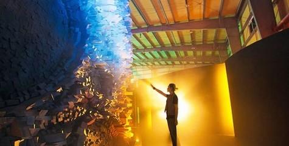

# 虚拟现实---从虚拟走向现实

## 定义：虚拟现实技术是一种可以创建和体验虚拟世界的计算机仿真系统，它利用计算机生成一种模拟环境，是一种多源信息融合的、交互式的三维动态视景和实体行为的系统仿真使用户沉浸到该环境中。（摘自百度）

## 涉及关键技术：
* 实时三维计算机图形技术；
* 广角（宽视野）立体显示技术；
* 对观察者头、眼和手的跟踪技术；
* 以及触觉/力觉反馈、立体声、网络传输、语音输入输出技术；

## 