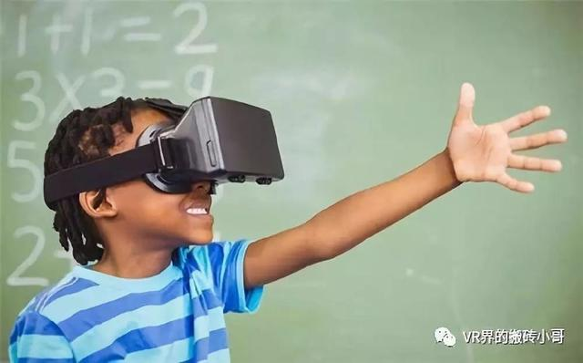

# 虚拟现实---从虚拟走向现实

## 定义：虚拟现实技术是一种可以创建和体验虚拟世界的计算机仿真系统，它利用计算机生成一种模拟环境，是一种多源信息融合的、交互式的三维动态视景和实体行为的系统仿真使用户沉浸到该环境中。（摘自百度）

## 涉及关键技术：
* 实时三维计算机图形技术；
* 广角（宽视野）立体显示技术；
* 对观察者头、眼和手的跟踪技术；
* 以及触觉/力觉反馈、立体声、网络传输、语音输入输出技术；

## 应用领域：
* 工业领域：

尤其在工业仿真方面已经出现了实际意义上的应用，虚拟现实已经被世界上的一些大的企业应用于工业的各个环节，利用收集到的虚拟生产数据，有效减少决策失误，优化工业结构，使企业更具竞争力。虚拟的演练场景可以使工人有效学习对突发事故的解决，防患于未然，且相比于传统消防生产演练，虚拟现实下的演练更具开放性，自由度也更高。

* 娱乐领域：

主要在游戏领域，虚拟现实下的游戏较传统游戏更具真实性，可以让玩家体验与原来日常生活截然不同的生活。带给玩家娱乐。在交流领域，当家人分隔两地，现实中的短暂分隔可以用虚拟现实中的陪伴来弥补，这样，可能就不会有什么异地恋老是分手的惨剧了。

* 医疗领域：

可以用于病人生理上的康复训练与心理上的康复训练，个人认为在心理康复方面应用更大，因为可以通过虚拟现实为病人构造令病人感到舒适的环境，便于病人打开心扉，从而解决现实中无法解决的问题。而虚拟现实中的手术环境，可以使医学生更快成为一名合格的医生。术前的模拟手术也可以降低风险。

* 教育领域：

用于构建虚拟课堂，为更多人提供教育资源，促进教育公平。当然，最主要的是为学生提供实验环境，且安全性高，耗费更少。

* 科研领域：为某些实验提供虚拟环境，减少实验耗费。当然，安全性更高。

## 面临的障碍：

* 设备需连接电缆等信号传输设备，装备者行动受限；
* 难以接收用户的行为信息；
* 各个开发公司标准不一；
* 使用者易疲倦；
* 相应软件不成熟；

## 营销方式：
个人认为有以下方式：
* 硬件控制方式：类似IBM的方式，控制虚拟设备的硬件生产，就可打造一个商业帝国；
* 底层软件控制：类似微软，控制虚拟设备底层软件，就可打造又一个商业帝国；