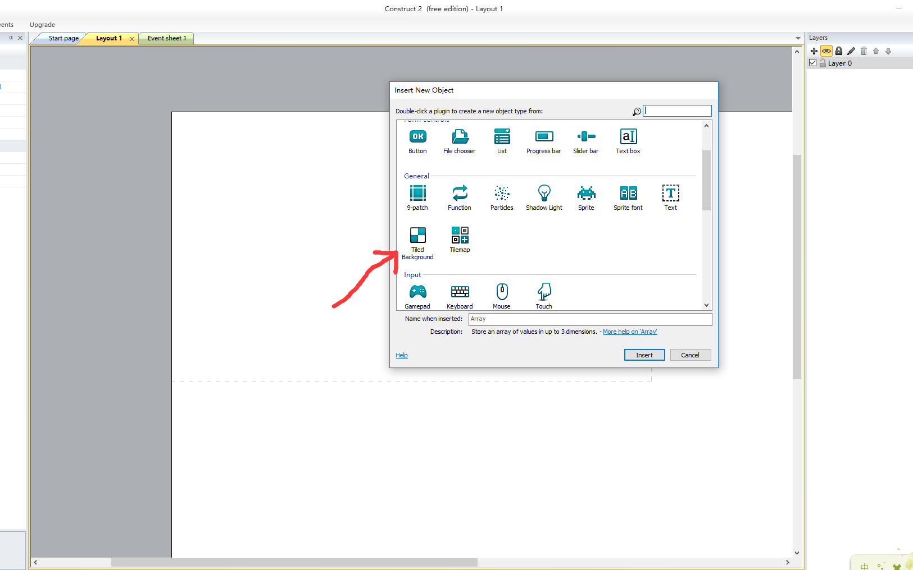
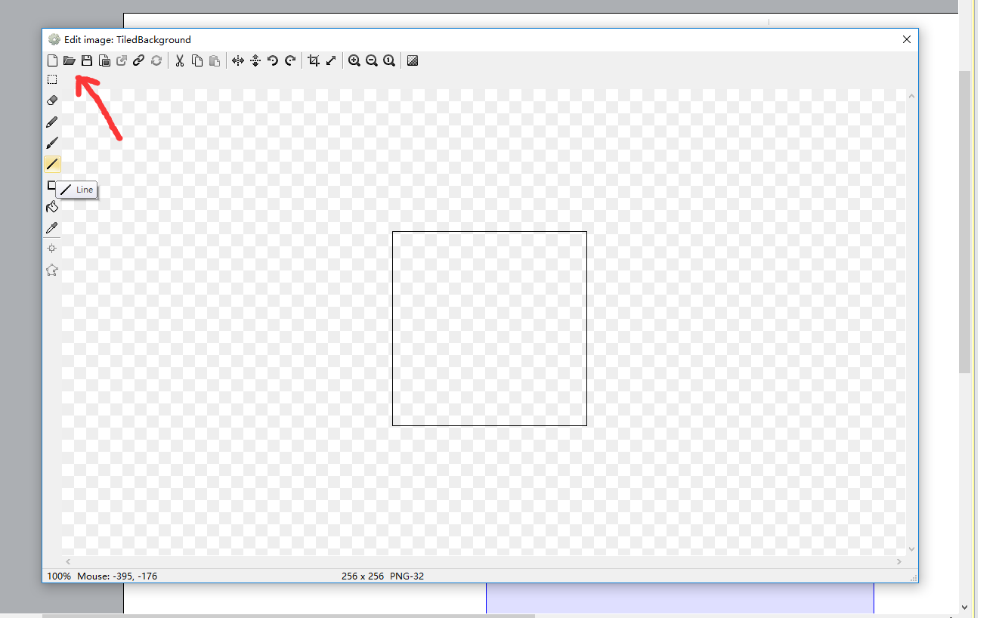
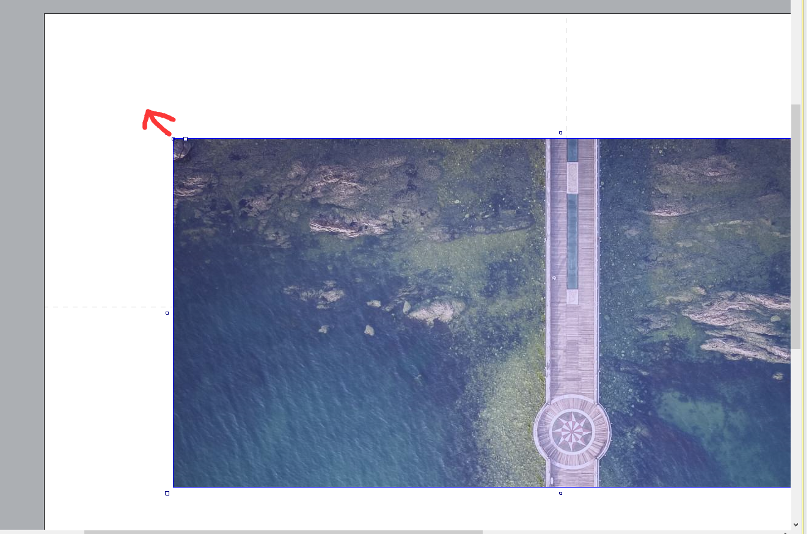
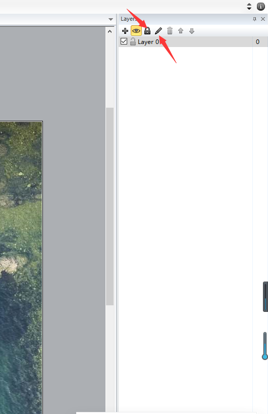
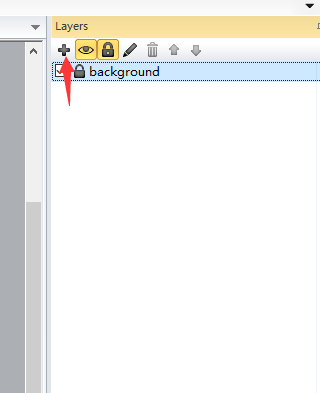
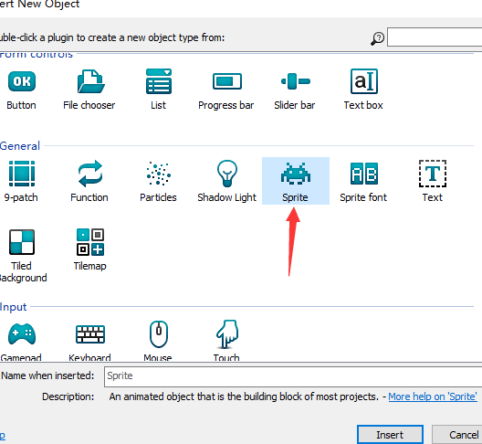
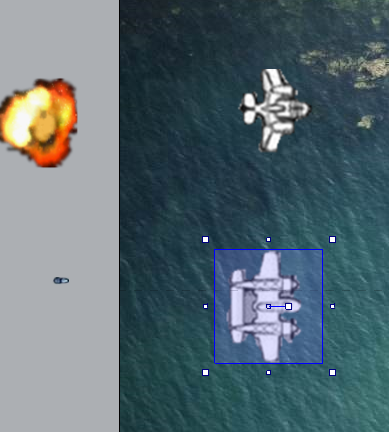
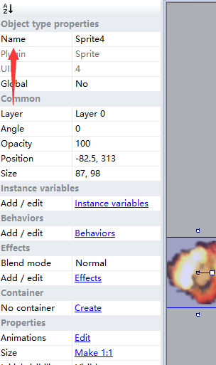
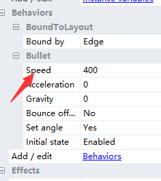

用Constuct2制作一个简单游戏
游戏，是现代社会一个习以为常的东西，我们之中的许多人都喜欢打游戏，它已经成为我们生活中一个不可或缺的东西。但玩了这么久游戏的你是否玩过自己制作的游戏？你是否梦想制作一个属于自己的游戏？现在用一款软件就可以轻松制作出一个简单的游戏实现你的梦想。这个软件就是contruct2。

废话不多说，接下来，让我们一起来学习如何用Constuct2制作一个小游戏。

新建文档：点击New Project新建一个New empty project。 

添加背景：第一步：先双击画布空白处，弹出插入界面，点击Tiled Backgroud;

之后点击insert，箭头变为十字，双击画布空白处后，弹出添加界面，点击红色箭头所指向的load an inmage from a file，选择图片后添加背景图片，添加完成后关闭页面背景图片，画布上就出现所选图片。

第二步：：以箭头拉动图片使背景图片布满画布空白处然后点击右侧红色箭头所指的铅笔图标将layer 0(图层0）rename（重命名为）Backgroud，后点击箭头所指锁头图标（锁定图层：接下来，我们将添加更多的对象。所以我们先把背景图层锁定了，这样才不会被我们再次选中）

添加更多对象：首先新建图层，在右侧原layer 0(图层0，现经过重命名（rename）变为Backgroud)处，点击“+”图标；生成另一个layer 0； 

 在layer 0中双击画布，点击红色箭头所指Sprite， 像添加背景那样添加角色。后将子弹和爆炸移到背景图片外，因为刚开始我们看不到。其次，双击画布，点击添加弹出对话框中Mouse与keyboard（用于之后添加事件）

完成后是这样

 

默认CT2会自动把我们的对象命名为Sprite,Sprite2,Sprite3,Sprite4，我们可以在他们各自的Properties bar属性面板里的Name属性里更改。依次更改Player,Monster,Bullet,Explosion（玩家，怪物，子弹，爆炸特效）。

添加行为：

在游戏中，每个角色都有自己的行为，比如给地板添加Solid行为，角色就会在上面跳来跳去（像超级玛丽）。关于行为，软件中预设的已经够我们用了。下面是我们将要用到的几种Behavior:

8 Direction movement: 这个行为可以让你实现给角色添加方向移动（方向键）的功能。 
Bullet movement:这个行为让对象朝着它当前的角度移动，比如，本例中玩家射出的子弹的移动行为，不要被这名字迷惑了，它不只适用于子弹，也可以应用于怪物等移动。在Contruct2里所有的移动行为都是通过添加速度向前行进。 
Scroll to：这个行为可以让运行时画布随着对象移来移去（滚动）。这个行为很适合于角色。 
Bound to layout：这个行为可以防止对象离开画布区域。这个行为对于角色来说也很重要。 
Destroy outside layout:当对象离开画布区域时，就将其销毁。比如本例中的子弹，如果不销毁的话，虽然子弹离开画布区域了，但是依然暂用内存。所以我们需要及时销毁不再需要的对象。 
Fade:这个行为可以给对象添加淡出效果，用于爆炸等特效的消失。

接下来我们就来给对象添加相应的行为.

例：
点击player找到properties bar属性面板找到Behaviors分类，点击Add/Edit弹出Behaviors行为对话框。点击对话框中的“+”图标添加行为：

player：8 Direction movement，Scroll to，Bound to layout；

Monster：Bullet movement，Bound to layout；

Bullet: Bullet movement，Destroy outside layout；

Explosion：Fade。

此时，我们运行查看游戏，会发现怪物一下子就飞出去了。我们来编辑下怪物的行为，选中Monster怪物对象。看到properties bar属性面板中，我们会发现属性栏里多出了其他一些属性，这些属性是添加了行为后才有的。

 更改speed速度为80（单位：像素/秒） 
同样的方法给Bullet子弹对象的速度更改为400，Explosion对象的Fade行为的Fade out time淡出时间为0.5秒

为添加足够Monster，可点击Monster后按Ctrl+鼠标滚轮滚动以复制Monster；

添加事件：

事件事实上是一种函数。首先，在画布区域上方的选项卡上切换到Event sheet1事件编辑器面板，一个列表的事件被成为Event sheet事件表。

我们来创建事件：

第一个事件 ：
使player面向鼠标：

在event sheet的空白位置双击，将打开添加事件对话框：不同的对象根据他们要做的行为拥有不同的条件和动作，在对话框中双击System对象，对话框中列出了所有System对象的条件：双击Every tick条件插入到事件表中。对话框将关闭，Every tick事件被创建，但没有actions(动作)

。

点击Add action，弹出对话框，对话框中列出了可以添加动作的对象，双击player对象，对话框列出了player对象可添加的动作，选取Set angle towards position动作该动作会自动计算角色到给定的X,Y坐标的角度。 点击Done完成操作
接下来要指定X,Y坐标值（动作的参数，条件同样可以带有参数）。我们输入Mouse.X和Mouse.Y 点击Done完成操作，这样
我们将使player（发射口）一直看向鼠标，这样我们点击发射子弹的时候，子弹将发往鼠标方向。如下：

第二个事件：使player发射子弹：双击空白位置，打开对话框，点击Mouse，添加Left button is dowm（当鼠标左键被点击）条件，添加条件成立后的动作点击player，选择行为Spawn an object（发射一个对象）选定被发射对象为bullet，选择子弹层，输入1（“Main”图层）,Image point（子弹的发射起点）保持默认为0。再双击Mouse下灰色部分，添加System对象，选择条件Every x tick（每x秒，x由你设定），用来限定子弹发射频率。如下：

第三个事件：子弹击中Monster，两者毁灭，产生爆炸特效：双击，选中Bullet，添加条件：On collision with another object（接触另一对象），添加Action，选中Bullet，添加行为Destroy ，再添加Action，选中Monster，添加行为Spawn another object（选择爆炸特效对象，输入1（“Main”图层）,Image point（发射起点）保持默认为0），再添加Action，选中Monster，添加行为Destroy。如下： 

这样一个小型游戏基本成型。
 
